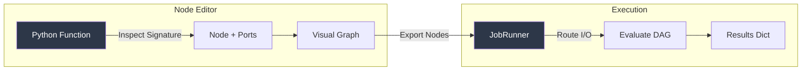

# QFlow

Visual node editor for building and executing computational graphs from Python functions. Built as a Dash component backed by Pydantic models.



## Features

- **Auto-generated nodes** -- Converts Python function signatures (including type hints, dataclasses, and Pydantic models) into draggable nodes with typed ports
- **Built-in controls** -- Automatic UI controls for `int`, `float`, `str`, `bool`, `color`, `date`, `time`, and more
- **DAG evaluation** -- `JobRunner` resolves dependency order, routes intermediate outputs, and supports sync, async, and distributed (Redis Queue) execution modes
- **Pydantic-first** -- Every node, port, and config is a serializable Pydantic object, making server-side rendering and API transport straightforward
- **Async & distributed** -- First-class support for `async` functions and optional RQ-backed distributed execution

## Quick Start

```bash
pip install qflow[full]   # includes dash + rq
```

```python
import dash
from dash import html, Input, Output, State
from flowfunc import Flowfunc
from flowfunc.config import Config
from flowfunc.jobrunner import JobRunner

def add(a: int, b: int) -> int:
    return a + b

def multiply(a: float, b: float) -> float:
    return a * b

config = Config.from_function_list([add, multiply])
runner = JobRunner(config)

app = dash.Dash(__name__)
app.layout = html.Div([
    html.Button(id="run", children="Run"),
    Flowfunc(id="editor", config=config.dict()),
    html.Div(id="output"),
], style={"height": "600px"})

@app.callback(Output("output", "children"), Input("run", "n_clicks"), State("editor", "nodes"))
def run(_, nodes):
    result = runner.run(nodes)
    return [html.P(f"{n.type}: {n.result}") for n in result.values()]

if __name__ == "__main__":
    app.run()
```

## Project Structure

```
quantum-flow/
├── flowfunc/
│   ├── Flowfunc.py        # Dash component wrapper
│   ├── config.py           # Config: node/port registry from function lists
│   ├── models.py           # Pydantic models (Node, Port, OutNode)
│   ├── jobrunner.py        # DAG evaluator (sync/async/distributed)
│   ├── distributed.py      # Redis Queue integration
│   ├── types.py            # Custom type definitions
│   ├── utils.py            # Signature inspection helpers
│   └── exceptions.py       # Custom exceptions
├── src/                    # React frontend source
├── app.py                  # Demo application with math + quantum gates
├── examples/               # Usage examples
├── docs/                   # Documentation & images
├── setup.py                # Package configuration
└── requirements.txt
```

## Tech Stack

| Layer | Technology |
|-------|-----------|
| Frontend | React (Flume-based node editor) |
| Backend | Python 3.10+, Dash 2.6+ |
| Models | Pydantic v2 |
| Distributed | Redis Queue (optional) |
| Packaging | setuptools |

## License

MIT
